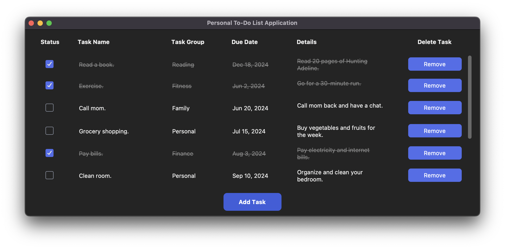

# [Personal ToDo List Application](https://www.xodivorce.in)
### 👀 Preview:



### Welcome to the Personal ToDo List Application..! - developed by ([@xodivorce](https://instagram.com/xodivorce)) 📝✨
[](https://github.com/xodivorce/xodivorce-portfolio/)
[](https://github.com/xodivorce/xodivorce-portfolio/)
[](https://github.com/xodivorce/xodivorce-portfolio/)
<br></br>

### 📌 Tech Stack

Here’s what fuels this site:


### 🛠️ How to Use:

Ready to contribute? Follow these steps to get started:
1. **Clone the Repository**
   - Clone the repository to your local machine:
     ```bash
     git clone git@github.com:xodivorce/personal_to_do_list_application.git
     ```

2. **Set Up Your Environment**
   - Ensure you have [Python](https://www.python.org/downloads/) version 3.8 or higher installed.

3. **Install Dependencies**
   - Navigate to the project directory and install the required packages:
     ```bash
     pip3 install -r requirements.txt
     ```

4. **Run the Application**
   - Start the application locally:
     ```bash
     python3 todo.py
     ```

🚀 **Got Ideas or Spotted a Bug?**  
Don’t be shy! [*Open an issue*](https://github.com/xodivorce/personal_to_do_list_application/issues) to discuss new features, enhancements, or any bugs you find. Your feedback is golden!!
- Let’s create something epic together! 🌟

### 📝 License & Usage

This project is licensed under the [**MIT License**](LICENSE.txt).  
You are free to use, modify, and distribute this code for personal or commercial purposes, as long as you include the original copyright and license notice in any copies or substantial portions of the software.

**🌟 Like this project? Please consider giving it a star to show your support!**

<br></br>

****

An Open Sourced Project - Crafted with ❤️ by **xodivorce**